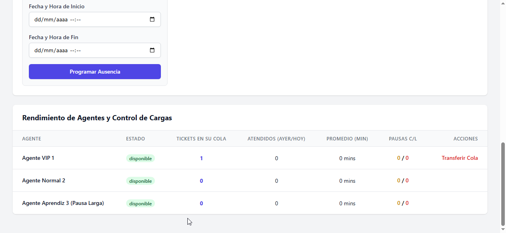
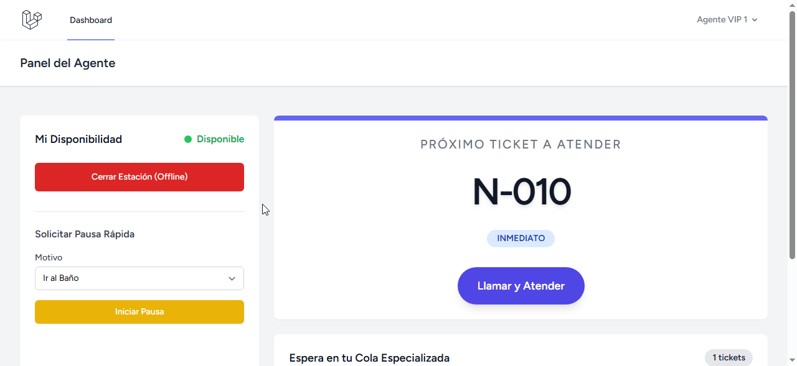
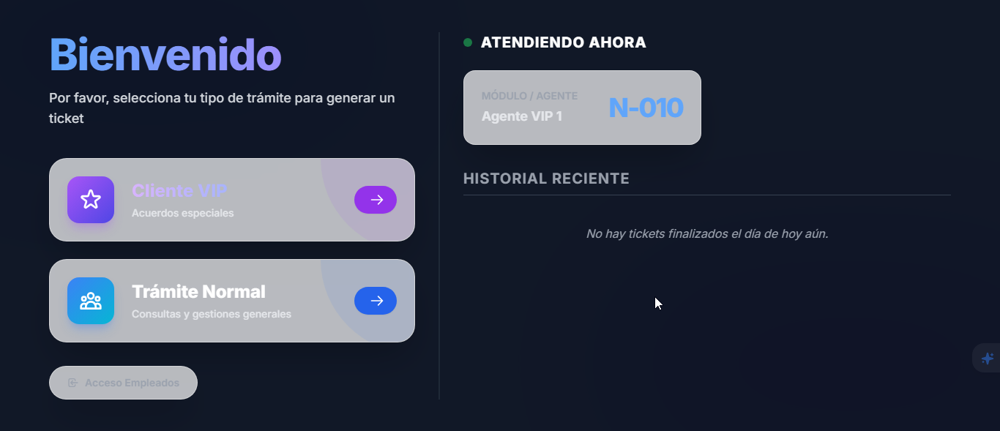
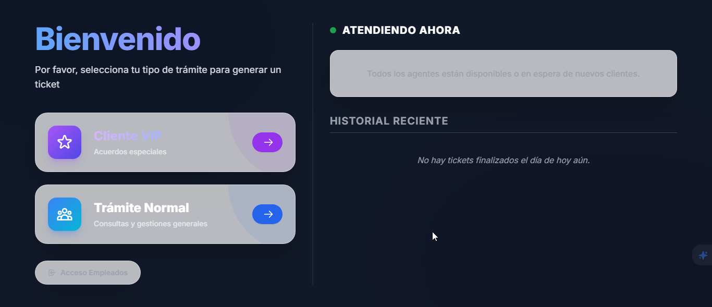
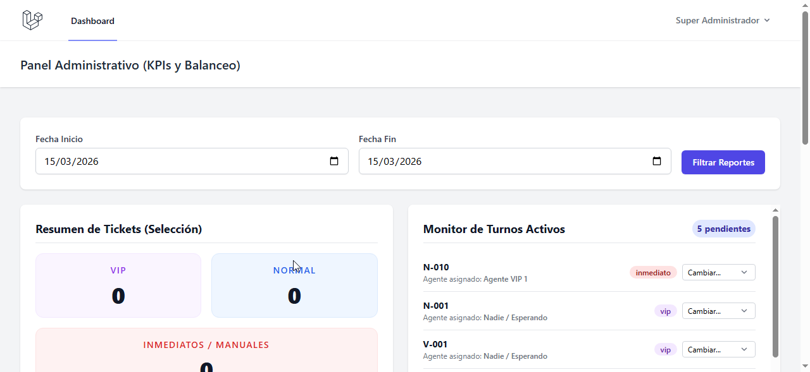
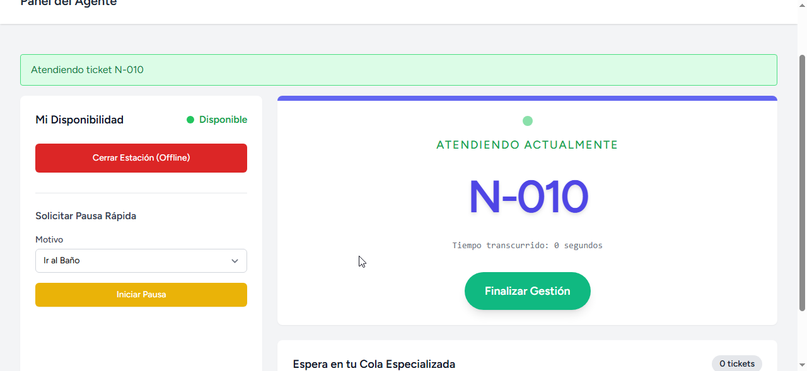
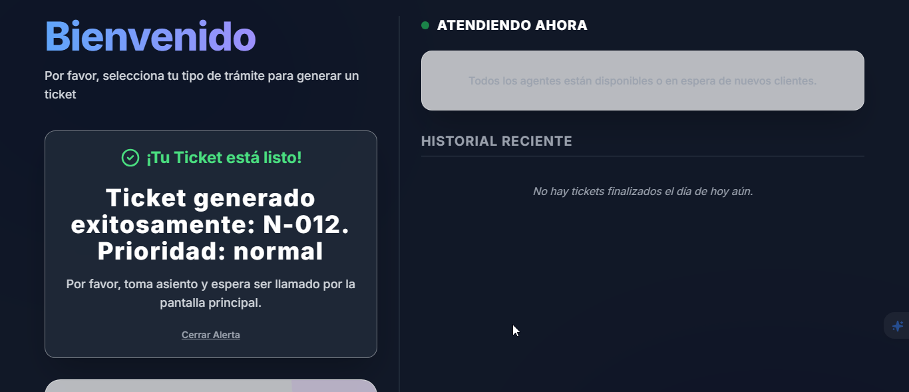

# 🎫 Sistema de Tickets con Prioridades en Tiempo Real

Bienvenido al **Sistema de Gestión de Tickets**, una solución moderna y eficiente construida con **Laravel 11**, **Tailwind CSS**, **Alpine.js** y **Laravel Reverb**. Este sistema permite gestionar colas de atención con prioridades (VIP y Normal) y actualizaciones instantáneas mediante WebSockets.

---

## 🚀 Características Principales

-   **Kiosco de Tickets**: Interfaz pública para que los clientes soliciten su turno.
-   **Priorización Inteligente**: Sistema de colas que prioriza automáticamente los tickets VIP.
-   **Actualización en Tiempo Real**: Visualización de turnos ("Atendiendo Ahora" y "Historial") que se actualiza automáticamente sin recargar la página gracias a **Laravel Reverb**.
-   **Panel de Agentes**: Gestión de disponibilidad, atención de tickets y registro de pausas de trabajo.
-   **Dashboard Administrativo**: Supervisión global y herramientas para transferir colas de atención.
-   **Diseño Premium**: Interfaz moderna, responsive y con soporte para modo oscuro.

---

## 👥 Usuarios de Prueba

Para probar las diferentes funcionalidades del sistema, puedes utilizar las siguientes credenciales generadas por el seeder:

| Rol | Email | Password |
| :--- | :--- | :--- |
| **Administrador** | `admin@sistema.com` | `password` |
| **Agente VIP** | `agente1@sistema.com` | `password` |
| **Agente Normal** | `agente2@sistema.com` | `password` |
| **Agente Aprendiz** | `agente3@sistema.com` | `password` |

---

## 🛠️ Requisitos del Sistema

-   PHP 8.2 o superior
-   Composer
-   Node.js & NPM
-   MySQL / SQLite / PostgreSQL

---

## ⚙️ Pasos para la Instalación

Sigue estos pasos para poner en marcha el proyecto en tu entorno local:

### 1. Clonar el repositorio
```bash
git clone https://github.com/franklinrony/sistema-tickets
cd sistema-tickets
```

### 2. Instalar dependencias
Instala las dependencias de PHP y JavaScript:
```bash
composer install
npm install
```

### 3. Configuración del Entorno
Copia el archivo de ejemplo y configura tu base de datos y variables de Reverb:
```bash
cp .env.example .env
php artisan key:generate
```
*Asegúrate de configurar `DB_DATABASE` y otras credenciales en el archivo `.env`.*

### 4. Base de Datos
Ejecuta las migraciones y carga los datos de prueba:
```bash
php artisan migrate --seed
```

---

## 🏃 Ejecución del Proyecto

Para que el sistema funcione correctamente con todas sus características (incluyendo tiempo real), debes ejecutar los siguientes comandos en terminales separadas:

### **Opción A: Laravel (Backend & Server)**
Sirve la aplicación PHP:
```bash
php artisan serve
```

### **Opción B: NPM (Frontend Assets)**
Compila y vigila los cambios en el CSS y JS:
```bash
npm run dev
```

### **Opción C: Reverb (WebSockets)**
Para habilitar las actualizaciones en tiempo real:
```bash
php artisan reverb:start
```

### **Opción D: Colas (Queue Worker)**
Si se utilizan jobs en segundo plano (opcional pero recomendado):
```bash
php artisan queue:work
```

---

## 📸 Vistas Importantes

-   **Página Principal (Turnero):** `http://localhost:8000/`
-   **Login:** `http://localhost:8000/login`
-   **Dashboard (Dinámico):** `http://localhost:8000/dashboard`

---

## 🖼️ Capturas de Pantalla

A continuación, algunas vistas del sistema en funcionamiento:

<details>
<summary><b>Haz clic para ver las capturas relacionadas al sistema</b></summary>

<br>















</details>

---

Desarrollado con ❤️ para una gestión de turnos impecable.
